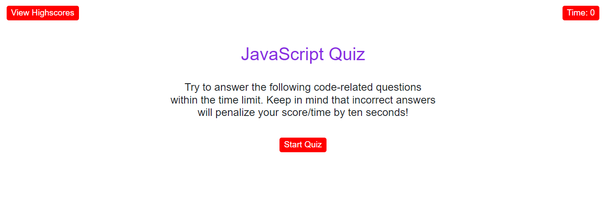

# JavaScript-Quiz

## Description
A timer-based quiz application having multiple choice JavaScript questions that stores high scores of multiple users using localstorage. Answering incorrectly results in penality of time.

## Prerequisites
N/A

## Features
* Muliple-choice questions about JavaScript.
* Score tracking.
* Responsive design for mobile and desktop use.
* Timer for each quiz session.

# Criteria
* GIVEN I am taking a code quiz
* WHEN I click the start button
* THEN a timer starts and I am presented with a question
* WHEN I answer a question
* THEN I am presented with another question
* WHEN I answer a question incorrectly
* THEN time is subtracted from the clock
* WHEN all questions are answered or the timer reaches 0
* THEN the game is over
* WHEN the game is over
* THEN I can save my initials and score

## Technologies Used
 Built with:
* HTML
* CSS
* JavaScript
* Local Storage
* (Bootstrap)

## Installation
N/A

## Usage
* Open the JavaScript Quiz web application in your browser.
* Click the "Start Quiz" button to begin.
* Read each question and select the correct answer from the multiple-choice options.
* After completing all questions, view your score.

## Project Link
Application can be viewed here: 
* [Live](https://yvonnesarah.github.io/JavaScript-Quiz/)

* [Repository](https://github.com/yvonnesarah/JavaScript-Quiz)

## Screenshot(S)
Start Screen

Example Question

End Screen

Highscores

## Credit
N/A

## Licence
Please refer to the LICENSE in the repo.